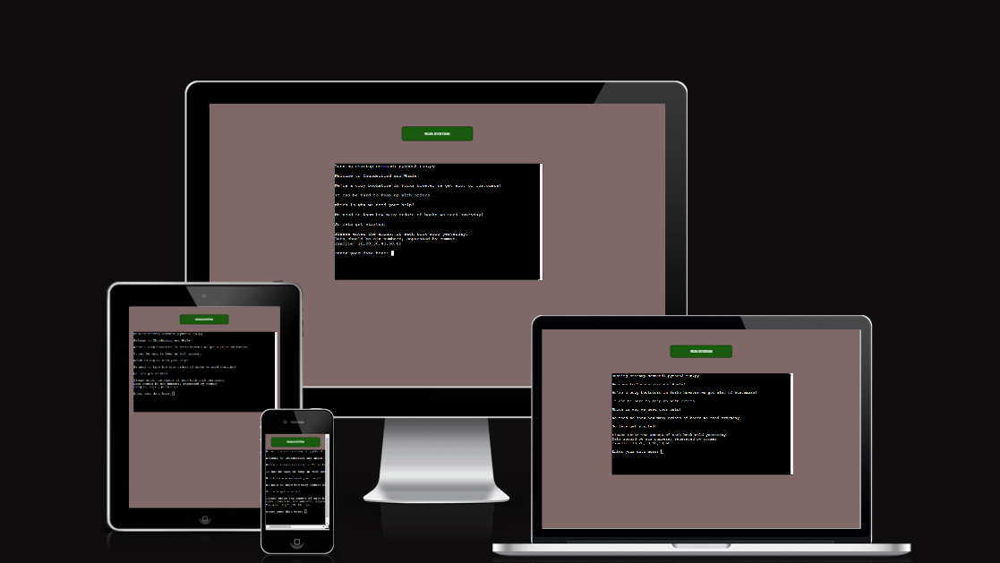
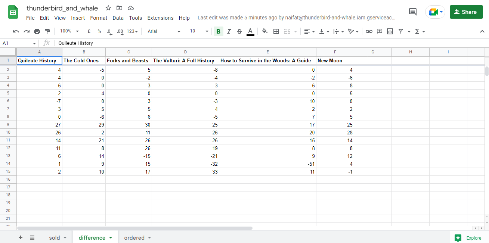

# **Thunderbird and Whale Bookstore System- Project Portfolio 3 - Python.**

The Thunderbird and Whale bookstore system is based on the notorious bookstore that Bella Swan is seen to visit in Twilight. It's situated in the town of Forks which has a very simplistic and calm nature surrounding the town- similarly, the app system I created also does not have an overload of information, The app is simply useful as it allows the owners of the bookstore to effectively and quickly recieve data on how many books the need to order into the shop at the beginning of the new week by calculating how many books were sold, ordered and the difference between these figures.

The live site is available for viewing here - <a href="https://***" target="_blank" rel="noopener">Thunder and Whale Bookstore System.</a>

# Contents

* [**Objective**](<#objective>)
* [**User Experience UX**](<#user-experience-ux>)
    * [Design Prototype](<#design-prototype>)
    * [System Structure](<#system-structure>)
    * [Python Logic](<#python-logic>)
    * [Data](<#data>)
    * [Design Choices](<#design-choices>)
    * [Colour Scheme](<#colour-scheme>)
* [**Features**](<#features>)
    * [Startup](<#startup>)
    * [Welcome Text](<#welcome-text>)
    * [Input Instructions](<#input-instructions>)
    * [Feedback](<#feedback>)
    * [Sold Sheet Update](<#sold-sheet-update>)
    * [Difference Sheet Update](<#difference-sheet-update>)
    * [Ordered Sheet Update](<#ordered-sheet-update>)
    * [Results](<#results>)
* [**Future Features**](<#future-features>)
    * [Last Restock Comparisons](<#last-restock-comparisons>)
* [**Technologies Used**](<#technologies-used>)
* [**Python Packages**](<#python-packages>)
* [**Testing**](<#testing>)
* [**Deployment To Heroku**](<#deployment-to-heroku>)
* [**Credits**](<#credits>)
    * [**Content**](<#content>)
    * [**Media**](<#media>)

# Objective

For my third project I wanted to create something simple, useful and something that still related to one of my passions. As a huge Twilight fan and bookworm that would love to own a book shop this simple but effective system is perfect. I believe this system of calculating future orders needed is also something that can be used by all business, just differin g in scale, therefore it is simple but highly effective.

[Back to Contents](<#contents>) 

# User Experience (UX)

## Design Prototype

I used Figma to design a very basic wireframe as I knew this command line application would be simple in its appearance. The system still ended up being slightly different with a dark brown background being used as opposed to a dark green and a button instead of a title above the terminal. However, I still preserved the simplistic and cozy theme of the site.

[Back to Contents](<#contents>)

## System Structure

The very simple Thunderbird and Whale Bookstore system simply contains a command line interface where the user is guided on what data they will need to input. Just above the interface is a 'Run System' button which allows for the site to be reloaded.

## Python Logic

I used the paint app on Windows to create a simple flowchart to showcase my python logic and how the system will process the data input and reach the final result message.

## Data

For this site, Google Sheets was used to store the data, update the data and compare the data. The [Google Sheet](https://docs.google.com/spreadsheets/d/1jorvEpWdPbdxXYKE7Tm0hVA3ahgTq5oP5v7CksHYmNc/edit#gid=1680754323) has three different worksheets, with one containing the data for the amound of books sold, another with the amount of books ordered and lastly a worksheet storing the difference between the two former worksheets so the bookstore can see if there was a surplus of data or not.

## Colour Scheme
-  Aligning with the gloomy and very cozy nature of the Twilight Saga movies, and the Thunderbird and Whale bookstore in the movie I kept the colours very cozy, and dark, reflecting the colours of nature as Twilight contains a large amount of nature imagery.
- Therefore, I decided to go for a dark brown for the background colour and I used a forest green for the 'Run System' button. The interface being black complients these colour well, with the white of the text allowing for efficient contrast for accessibility purposes.

[Back to Contents](<#contents>)

